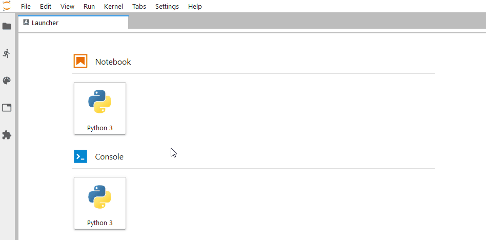

# jupyter_conda

[](https://anaconda.org/conda-forge/jupyter_conda)
[](https://www.npmjs.com/package/jupyterlab_conda)
[](https://travis-ci.org/fcollonval/jupyter_conda) [](https://ci.appveyor.com/project/fcollonval/jupyter-conda) [](https://coveralls.io/github/fcollonval/jupyter_conda?branch=master)

Provides Conda environment and package access extension from within Jupyter Notebook and JupyterLab.

This is a fork of the Anaconda [nb_conda package](https://github.com/Anaconda-Platform/nb_conda). The decision to fork it came due
to apparently dead status of the previous package and a need to integrate it within JupyterLab.

## Install

_Requirements_

- conda >= 4.5
- notebook >= 4.3
- JupyterLab 0.35 (for the jupyterlab extension only)

To install in the classical notebook:

```shell
conda install -c conda-forge jupyter_conda
```

To install in the JupyterLab:

```shell
conda install -c conda-forge jupyter_conda
jupyter labextension install jupyterlab_toastify jupyterlab_conda
```

## Classical Jupyter Notebook

### Conda tab in the Jupyter file browser

This extensions adds a Conda tab to the Jupyter file browser. Selecting the Conda tab
will display:

- A list of the Conda environments that current exist
- The list of Conda packages available in currently configured channels
  (http://conda.pydata.org/docs/config.html#channel-locations-channels)
- The list of packages installed in the selected environment.

You can click on the name of an environment to select it. That will allow you to:

- see the packages installed in the environment
- install new packages from the available package list
- check for updates on selected (or all) packages
- update selected (or all) packages in the environment.

### Conda in the Notebook view

This extension adds a Conda Packages item to the Kernel menu. Selecting this item displays
the list of Conda packages in the environment associated with the running kernel, and the
list of available packages. You can perform the same actions as in the Conda tab, but only
against the current environment.

## JupyterLab

This extension add a new entry _Conda Packages Manager_ in the _Settings_ menu.



## Creating New Environments

There are two ways to create an environment:

- Create a new environment
  Use the New Environment button at the top of the page, and select `Python 2`, `Python 3`, or `R` to create a
  base environment with the corresponding packages. Note that if you want to run a
  Jupyter python kernel in the new environment, you must also install the `ipykernel`
  package in the environment.

- Clone an existing environment
  Click the clone button next to an environment in the list, and enter the desired name of the
  new environment.

## Development

```shell
conda create -y -n jupyter_conda python jupyterlab
conda install -y -n jupyter_conda --file requirements.txt -c conda-forge
source activate jupyter_conda
python setup.py develop
jupyter nbextension install jupyter_conda --py --sys-prefix --symlink
jupyter nbextension enable jupyter_conda --py --sys-prefix
jupyter serverextension enable jupyter_conda --py --sys-prefix

cd labextension
jupyter labextension install .
```

## Changelog

### 2.4.2

- BUG environment not shown
- BUG Installing package in develop mode fails if in user home or containing spaces
- Improve error feedback from API to frontend

### 2.4.1

- BUG `conda search` crashes for conda 4.6

### 2.4.0

- Add installation of package in development mode (through `pip`)

### 2.3.x

- Add JupyterLab extension inspired by Anaconda Navigator
  - Retrieve conda package description
  - Add link to package website (if available)
- Support conda >=4.5
- Make all conda request asynchronously
- Use the automatic installation for Jupyter Notebook extension (see [here](https://jupyter-notebook.readthedocs.io/en/stable/examples/Notebook/Distributing%20Jupyter%20Extensions%20as%20Python%20Packages.html))

### 2.2.1

- fix bug in check updates feature

### 2.2.0

- support conda 4.3
- support notebook security fix introduced in notebook 4.3.1

### 2.1.0

- fix environment export button
- allow environment names with one letter and validate against "suspicious" characters

### 2.0.0

- update to new jupyter_conda_kernels naming scheme
- namespace all API calls into `/conda/`

### 1.1.0

- fix usage in root environment

### 1.0.1

- minor build changes

### 1.0.0

- Update to notebook 4.2
