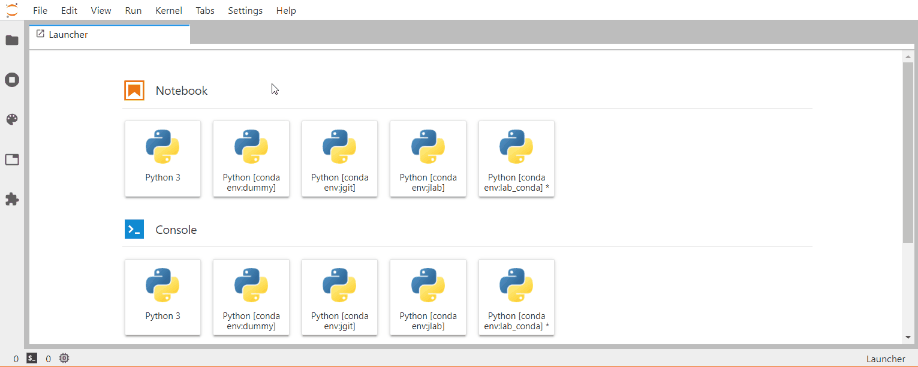
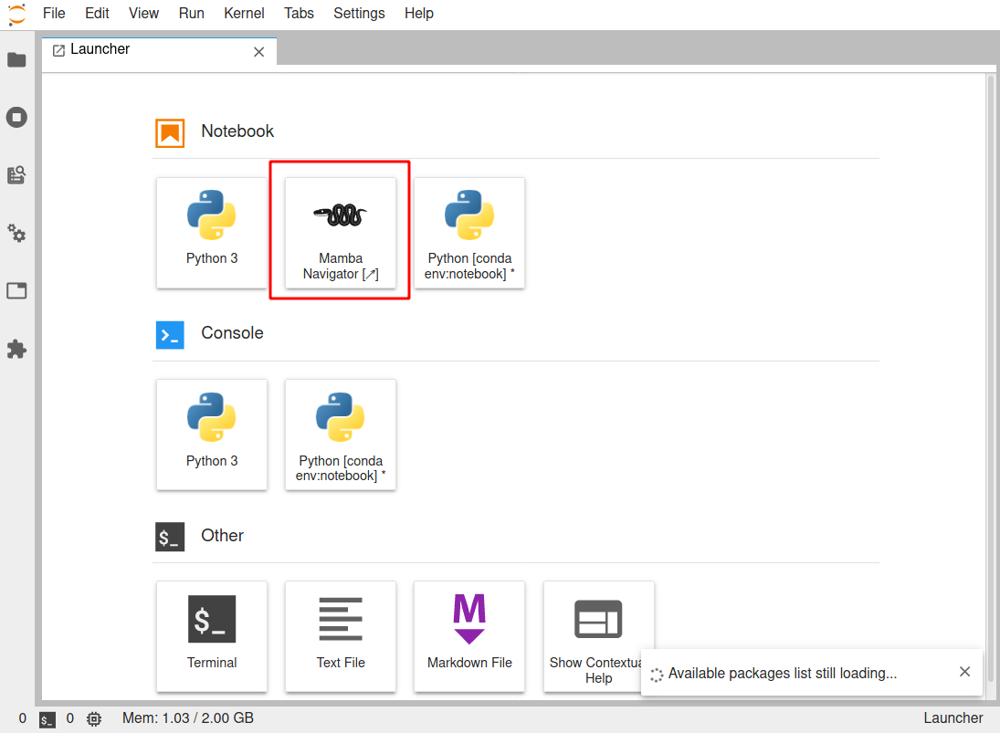

# Gator

The Mamba Navigator, a Web UI for managing conda environments

[](https://mybinder.org/v2/gh/mamba-org/gator/master?urlpath=lab)
[](https://anaconda.org/conda-forge/mamba_gator)
[](https://www.npmjs.com/package/@mamba-org/gator-lab)
[](https://github.com/mamba-org/gator/actions?query=workflow%3ATest)
[](https://coveralls.io/github/mamba-org/gator?branch=master)
[](https://petstore.swagger.io/?url=https://raw.githubusercontent.com/mamba-org/gator/master/mamba_gator/rest_api.yml)

Provides Conda/Mamba environment and package management as a [standalone application](#Navigator) or as extension for [JupyterLab](#JupyterLab).

## Install

_Requirements_

- conda >= 4.5 or mamba >=0.5
- JupyterLab 1.x, 2.x or 3.x (for the JupyterLab extension only)

> Starting from 3.4, this extension will use [mamba](https://github.com/mamba-org/mamba) instead of `conda` if it finds it.

To install in the classical notebook:

```shell
conda install -c conda-forge mamba_gator
```

To install in the JupyterLab:

```shell
conda install -c conda-forge jupyterlab mamba_gator
```

If you use JupyterLab 1.x or 2.x, you can install the extension with the following command:

```shell
jupyter labextension install @mamba-org/gator-lab
```

> Optionally, you could install [`jupyterlab-tour`](https://github.com/fcollonval/jupyterlab-tour) to
> add a help tour for the conda packages manager.

## JupyterLab

This extension adds a new entry _Conda Packages Manager_ in the _Settings_ menu.

> The first time, it can take quite some time to build the available packages list. But once it is obtained,
> it will be cached and updated to the background to have a smoother user experience.



## Navigator

This project contains a standalone navigator application sharing much of the code
of the JupyterLab extension.

## Classical Jupyter Notebook

The classical Jupyter Notebook is supported only for version prior to 5. But you can
directly manage the conda environments with the standalone navigator tool. For that
you need to execute the following command in a terminal:

```
gator
```

## Creating New Environments

There are three ways to create an environment:

- Create a new environment
  Use the New Environment button at the top of the page, and select `Python 3`, or `R` to create a
  base environment with the corresponding packages. Note that if you want to run a
  Jupyter python kernel in the new environment, you must also install the `ipykernel`
  package in the environment.

- Clone an existing environment
  Click the clone button next to an environment in the list, and enter the desired name of the
  new environment.

- Import an exported environment from a YAML file

### Try it online

Open Mamba Navigator: [](https://mybinder.org/v2/gh/mamba-org/gator/master?urlpath=mamba/navigator)

Open JupyterLab: [](https://mybinder.org/v2/gh/mamba-org/gator/master?urlpath=lab)



## Development

```shell
conda create -c conda-forge -y -n gator python jupyterlab=3
conda install -c conda-forge -y -n gator --file requirements_dev.txt
conda activate gator
pip install -e .
jupyter server extension enable mamba_gator --sys-prefix

yarn install
yarn run build:dev
jupyter labextension link packages/common/ packages/labextension/
```

## Acknowledgements

This work started as a fork by [@fcollonval](https://github.com/fcollonval/) of the Anaconda [nb_conda package](https://github.com/Anaconda-Platform/nb_conda). The decision to fork it came due
to apparently dead status of the previous package and a need to integrate it within JupyterLab.

Then with the [mamba initiative](https://medium.com/@QuantStack/open-software-packaging-for-science-61cecee7fc23) pushed by QuantStack it made
sense to move the project in the `mamba-org` organization.

## Changelog

### 5.1.0

- Feature
  - Use much faster `mamba repoquery search` command to list packages instead of `conda search` [#133](https://github.com/mamba-org/gator/pull/133) (Thanks to @ericpre)
- Bug fix
  - Fix mamba detection on Windows [#135](https://github.com/mamba-org/gator/pull/135) (Thanks to @ericpre)

### 5.0.0

- Features
  - Update to JupyterLab 3 and the new Jupyter Server  
  You don't need to install anything more than the pip or conda package.
  - Drop support for the classical notebook.

### 4.1.0

- Features
  - Dependencies graph (by clicking on the installed version for now)  [#83](https://github.com/mamba-org/gator/issues/83)
- Bug fix
  - Fix missing classical notebook extension [#115](https://github.com/mamba-org/gator/issues/115)
  - Fix mamba not detected on Windows [#119](https://github.com/mamba-org/gator/issues/119)

### 4.0.0

- Features
  - Moving to mamba-org
  - Integrate a standalone application
  - Common frontend for JupyterLab, classical Notebook and Gator
  - Depend optionally on `nb_conda_kernels`

### 3.4.1

- Features
  - Better logger
- Bugs
  - Reduce UI freezing time by running expensive code in asynchronous executor

### 3.4.0

- Features
  - Use `mamba` if available. Otherwise use `conda` [#46](https://github.com/mamba-org/gator/issues/46)
  - Move to GitHub workflow (extend coverage to JupyterLab code)
- Bugs
  - Fix wrong redirection url in classic notebook [#47](https://github.com/mamba-org/gator/issues/47)
  - Fix channel given by full URL not properly handle [#55](https://github.com/mamba-org/gator/issues/55)

### 3.3.1

- Bugs
  - Fix export always from history (settings ignored)

### 3.3.0

- Features
  - Add a settings `fromHistory` to export an environment using [`--from-history`](https://docs.conda.io/projects/conda/en/latest/user-guide/tasks/manage-environments.html#exporting-an-environment-file-across-platforms) (available for conda >= 4.7.12) [#39](https://github.com/mamba-org/gator/pull/39)
- Bugs
  - Fixes absent `channeldata.json` file [#36](https://github.com/mamba-org/gator/issues/36)
  - Fixes environment update absent from public API [#37](https://github.com/mamba-org/gator/pull/37)
- Documentation
  - Start REST API description with Swagger

### 3.2.0

- Available package cache file is now writable for everybody to avoid trouble in multi-user context. [#25](https://github.com/mamba-org/gator/pull/25)
- Add update environment from file through REST endpoint PATCH /environments/ [#26](https://github.com/mamba-org/gator/pull/26)
- Switch to newer Python syntax async-await
- To improve UI reactivity in Jupyterlab:

  - Long running task can now be cancelled #32
  - The available packages list is used to find updatable package. conda update --dry-run --all is not used any longer. But it is still used if the user request updating all possible packages.

### 3.1.0

- Request environment list accept now `whitelist`=0 or 1 query arguments. If 1, the environment
  list is filtered to respect `KernelSpecManager.whitelist`. Default is 0, but it could be modified
  in user settings.
- JupyterLab extension
  - `IEnvironmentManager.getPackageManager()` returns always the same `Conda.IPackageManager`
    otherwise signaling package operations would have been meaningless.
  - Add ability to specify kernel companions; i.e. check that if some packages are installed in a
    kernel, they must respect a certain version range. Companions can be specified through user
    settings.
  - Small UI tweaks

### 3.0.0

- Rework the server/client API to be more RESTful and returns 202 status for long operations
- Cache available packages list in temp directory
- Improve greatly the coverage for the server extension
- JupyterLab extension only:
  - Allow the user to change the proposed environment when creating one from scratch
  - Add signals to handle environnements and packages changes (see `labextension\src\__tests__\services.spec.ts`)
  - Improve the UI reactivity by using `react-virtualized` for the packages list
  - Improve the look and feel
- Available packages truncation has been removed.

### 2.5.1

- Catch SSLError when requesting `channeldata.json` file

### 2.5.0

- Export in YAML format the environment (import in the older format is still supported).
- Improve responsiveness by loading first installed packages. Then request available one.
- BUG error is prompt when an environment is deleted although everything went well
- Cache some API requests (GET environments, GET channels and GET available packages).
- Available packages are now truncated to 100.
  - Use query argument `$skip` to skip N first packages
  - If the list is longer than 100, a entry `$next` in the response is returned. This
    is the request url to use to get the next batch of packages.
- Report full error message in web browser console to ease debugging.

### 2.4.2

- BUG environment not shown
- BUG Installing package in develop mode fails if in user home or containing spaces
- Improve error feedback from API to frontend

### 2.4.1

- BUG `conda search` crashes for conda 4.6

### 2.4.0

- Add installation of package in development mode (through `pip`)

### 2.3.x

- Add JupyterLab extension inspired by Anaconda Navigator
  - Retrieve conda package description
  - Add link to package website (if available)
- Support conda >=4.5
- Make all conda request asynchronously
- Use the automatic installation for Jupyter Notebook extension (see [here](https://jupyter-notebook.readthedocs.io/en/stable/examples/Notebook/Distributing%20Jupyter%20Extensions%20as%20Python%20Packages.html))

### 2.2.1

- fix bug in check updates feature

### 2.2.0

- support conda 4.3
- support notebook security fix introduced in notebook 4.3.1

### 2.1.0

- fix environment export button
- allow environment names with one letter and validate against "suspicious" characters

### 2.0.0

- update to new jupyter_conda_kernels naming scheme
- namespace all API calls into `/conda/`

### 1.1.0

- fix usage in root environment

### 1.0.1

- minor build changes

### 1.0.0

- Update to notebook 4.2
